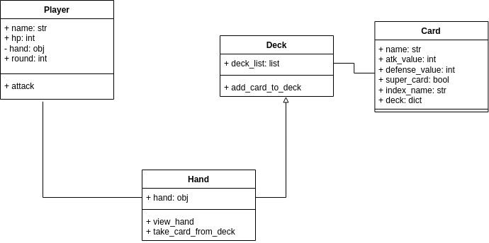

# BattleCard

--------------------------------------------------------------------------------------------------------------------

  
<strong>Diagrama UML</strong>
 

--------------------------------------------------------------------------------------------------------------------

  
<strong>🎲Regras do jogo🎲</strong>
 

- BattleCard é um jogo de cartas onde as rodadas envolvem a comparação de atributos. O objetivo é fazer o oponente chegar a zero de HP para vencer, usando diferentes interpretações, como pontuação crescente ou zerar o HP do oponente.

- Durante um ataque, há 3 situações:
  1. Ataque maior que defesa: O perdedor perde HP igual ao valor do ataque.
  2. Ataque menor que defesa: Nada acontece com o HP, ou opcionalmente, o perdedor perde 50% do valor de ataque.
  3. Ataque igual à defesa: Nada acontece.

- Exemplos de jogos semelhantes são Yu-Gi-Oh!, Hearthstone e Pokemon. O jogo termina quando alguém atinge zero ou menos de HP.

Este é um projetin para treino de POO em Python

Este é mini projeto criado por @gabrielsfdev em fase alpha pode conter falhas de lógica, erros de estruturação e quaisquer outros contratempos, esteja ciente disso antes de iniciar.